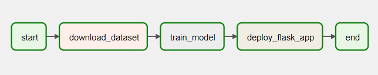

# Customer Churn Prediction 🚀

This project leverages machine learning to predict customer churn, a critical task for businesses aiming to retain their customers. Businesses can take proactive steps to improve customer satisfaction and reduce churn rates by predicting which customers are likely to leave.

## 🌟 Project Overview

The project uses a logistic regression model to predict customer churn based on various features extracted from a dataset. The model is trained using the data provided in the `WA_Fn-UseC_-Telco-Customer-Churn.csv` file, including tenure, monthly charges, total charges, and various other customer attributes.

### Key Features:
- **End-to-End Pipeline**: The project includes an end-to-end pipeline managed with Apache Airflow, from data extraction and preprocessing to model training and deployment.
- **AWS Integration**: The project leverages AWS services such as S3 and SageMaker to perform model training in a scalable and efficient environment.
- **Dockerized Environment**: The project environment is fully containerized using Docker, ensuring easy setup and consistent performance across different environments.

## 🛠 Pipeline Visualization

<div style="text-align: center;">
  
</div>

The pipeline follows a simple yet effective workflow: it starts by downloading the dataset, then moves on to training the model, and finally completes the process. Each task is managed and orchestrated by Apache Airflow, ensuring smooth and automated execution.
## 🔧 Technologies & Tools

- **Python**: The core language used for data processing and model building.
- **Pandas & Scikit-Learn**: Essential libraries for data manipulation and machine learning.
- **Boto3**: AWS SDK for Python, used for interaction with AWS services.
- **Apache Airflow**: Workflow management platform for orchestrating the pipeline.
- **AWS S3 & SageMaker**: Used for storing data and running machine learning jobs in the cloud.
- **Docker**: Containerization of the environment to ensure consistent execution.
- **GitHub**: Version control and collaboration platform.

## 📁 Project Structure

```bash
Customer Churn Prediction Project/
├── Dockerfile                       # Docker configuration for setting up the environment
├── airflow/
│   ├── dags/
│   │   └── churn_prediction_dag.py  # Airflow DAG definition
|   |   └── docker-compose.yaml      # Configuration for running Airflow and other services
├── train.py                         # Model training script
|── WA_Fn-UseC_-Telco-Customer-Churn.csv # Dataset
└── README.md                        # Project documentation (you're reading it now!)
```
## 🚀 Getting Started

### Prerequisites

Ensure the following are installed on the local machine:

- Docker & Docker Compose
- Git

### Installation

**Clone the repository:**

```bash
git clone https://github.com/aravinda-1402/Customer-Churn-Prediction.git
cd Customer-Churn-Prediction/airflow
```
Build and run the Docker containers:
```
docker-compose up -d
```

**Access Apache Airflow:**

Once the containers are up and running, access the Airflow web UI by navigating to http://localhost:8080 in the browser.

**Running the Pipeline**
1. Trigger the DAG: In the Airflow web UI, navigate to the churn_prediction_pipeline DAG and trigger it manually to start the pipeline.

2. Monitor the DAG: Monitor the progress and logs of each task in the pipeline through the Airflow interface.

## 🧠 Training the Model
The model training is handled within the `train_model` task in the Airflow DAG. This task:

* Downloads the dataset from S3.
* Preprocesses the data (handling missing values, encoding categorical variables, etc.).
* Trains a logistic regression model.
* Uploads the trained model back to S3 for future predictions.

## 📊 Results & Evaluation
Once the model is trained, it will be stored in the `model-output/` directory in the specified S3 bucket. The model's performance can be evaluated based on accuracy, precision, recall, and F1-score using standard classification metrics in scikit-learn.

## 💡 Future Work
* Model Improvement: Experiment with other models like Random Forest, Gradient Boosting, or even deep learning models to improve performance.
* Hyperparameter Tuning: Implement hyperparameter tuning using GridSearchCV or RandomizedSearchCV.
* Real-Time Prediction Service: Develop a real-time prediction API using Flask or FastAPI and deploy it on AWS Lambda or EC2.
